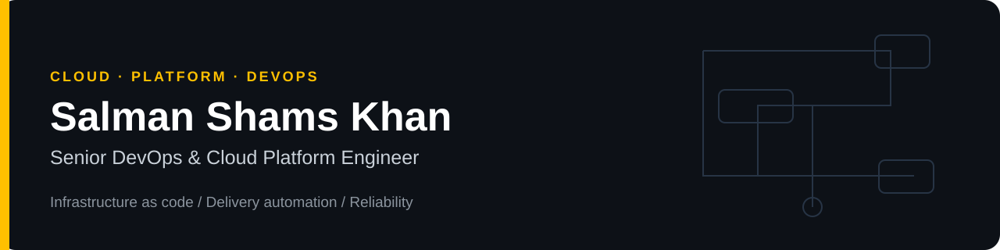
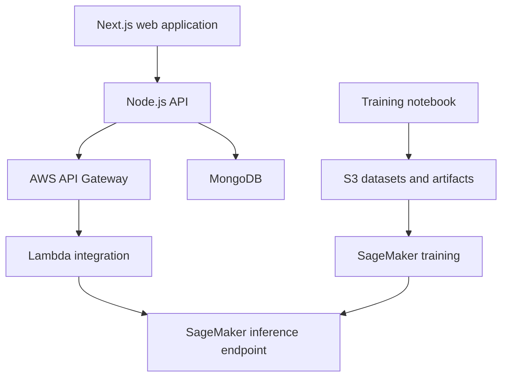

  <a href="https://www.linkedin.com/in/salman-shams-khan-11378261">LinkedIn</a> ·
  <a href="mailto:Salmanshamskhan@gmail.com">Contact</a> · Karachi, Pakistan · Open to remote opportunities

## Engineering focus

I am Salman, a cloud and DevOps engineer with **10+ years of infrastructure and platform experience**. I work across AWS, Azure, Kubernetes, infrastructure as code and delivery automation. My background includes Principal DevOps roles, solutions architecture, enterprise platform operations and server administration.

My work connects application delivery with the responsibilities that follow deployment: access controls, monitoring, incident response, recovery procedures and cost-aware infrastructure decisions. I work with developers, QA teams and stakeholders to turn architecture into a system teams can operate.

## Technology stack

| Area | Technologies |
|---|---|
| Cloud and integration | AWS, Azure, Azure API Management, Function Apps, Key Vault, Service Bus |
| Containers and platforms | Docker, Kubernetes, EKS, Helm |
| Infrastructure automation | Terraform, CloudFormation, Ansible |
| Delivery and GitOps | GitHub Actions, Azure DevOps, Jenkins, GitLab CI, Argo CD |
| Observability | Prometheus, Grafana, ELK, Application Insights, Log Analytics |
| Automation and operations | Python, Bash, Groovy, Linux, IAM, RBAC, disaster recovery |

## Portfolio guide

These repositories are public engineering examples. Their READMEs describe implementation scope, setup and operational limits; client work is described separately in my CV.

| Repository | What to review | Scope |
|---|---|---|
| [Terraform infrastructure](https://github.com/SalmanShamsKhan/DevOps-GitOps-terraform-stepup-part1) | EKS node groups, VPC topology and infrastructure workflow | AWS infrastructure example |
| [Container delivery](https://github.com/SalmanShamsKhan/DevOps-GitOps-Code-App-setup) | Maven tests, code analysis, container publishing and EKS deployment | Application delivery example |
| [Kubernetes logging](https://github.com/SalmanShamsKhan/whitehelmet-devops-challenge) | Terraform, Helm, ELK/Filebeat and deployment evidence | Technical challenge |
| [Jenkins pipeline](https://github.com/SalmanShamsKhan/DevOps-CI-CD-Pipeline-for-Containerized-Applications-Using-Jenkins-Docker-Kubernetes-Helm-SonarQube) | Jenkins stages, SonarQube quality gates and Helm rollout | CI/CD example |
| [Python transfer automation](https://github.com/SalmanShamsKhan/File-Transfer-FTP-to-S3-Python) | SFTP-to-S3 integration and multipart transfer | Automation example |

## ML platform learning project

**MedicAI** is a course-based image-classification application from Patrik Szepesi's [Deploy a Production Machine Learning model with AWS & React](https://www.udemy.com/course/build-and-deploy-a-ml-model-to-production-with-aws-and-react/). The learning architecture connects a Next.js frontend and Node.js API with AWS API Gateway, Lambda, SageMaker and S3.

| Component | My portfolio fork |
|---|---|
| Node.js backend | [MedicAIBackEnd](https://github.com/SalmanShamsKhan/MedicAIBackEnd) |
| Next.js frontend | [MedicAIFrontEnd](https://github.com/SalmanShamsKhan/MedicAIFrontEnd) |
| Training and evaluation notebook | [StartingNotebook](https://github.com/SalmanShamsKhan/StartingNotebook) |

I keep the course origin explicit. My documented DevOps improvements can be reviewed through the forks' pull requests and commit history; the course material itself is not a claim of client production work.

## How I approach platform work

- **Delivery:** version infrastructure, review changes and keep deployment steps reproducible.
- **Security:** keep credentials out of source, limit access and review dependencies and container images.
- **Reliability:** define health signals, recovery steps and clear ownership for incidents.
- **Documentation:** explain architecture choices, costs, trade-offs and validation evidence.
- **Leadership:** coordinate releases and technical decisions across engineering and business teams.

## Background

Principal DevOps Consultant — Systems Limited · Principal DevOps Engineer — Nisum · Solutions Architect — Wateen Telecom · Solutions Architect and DevOps Engineer — IT Retina · Server Administrator — IROS

MS Software Project Management and BS Computer Science, FAST NUCES · AWS Certified Solutions Architect Associate

Live GitHub activity

This third-party widget may be unavailable or rate-limited. It is supplemental; repository code, pull requests and documentation are the primary evidence.

